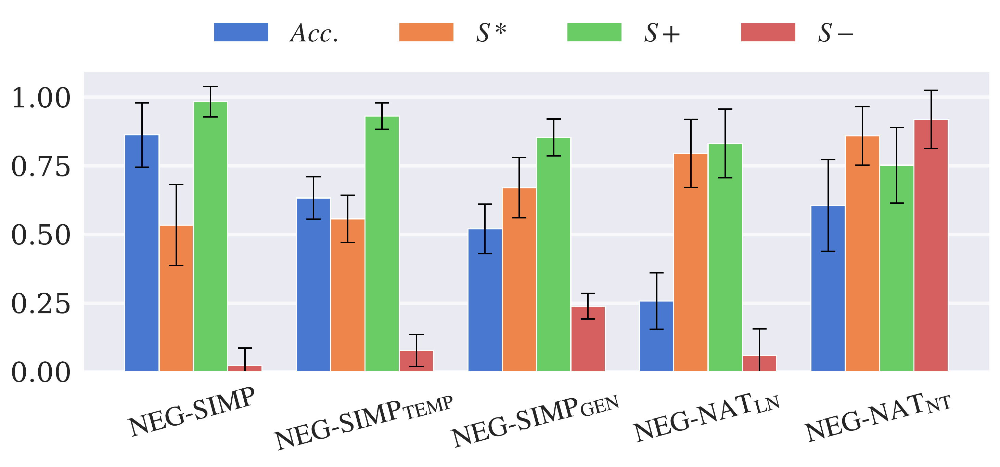
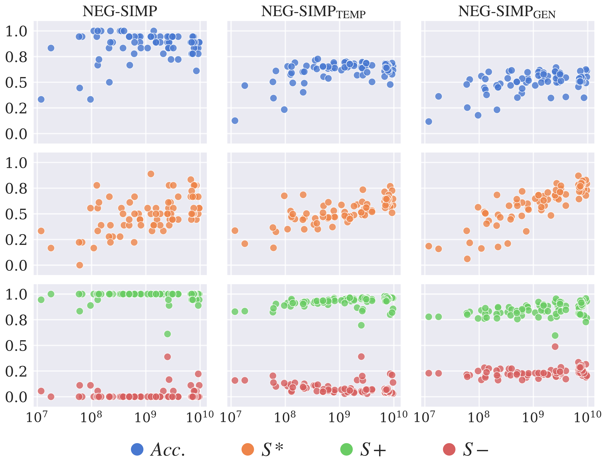
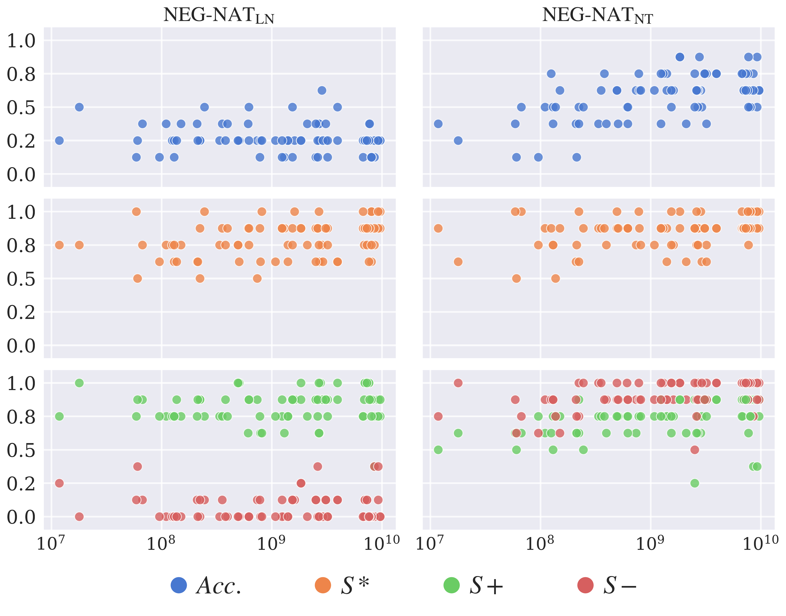
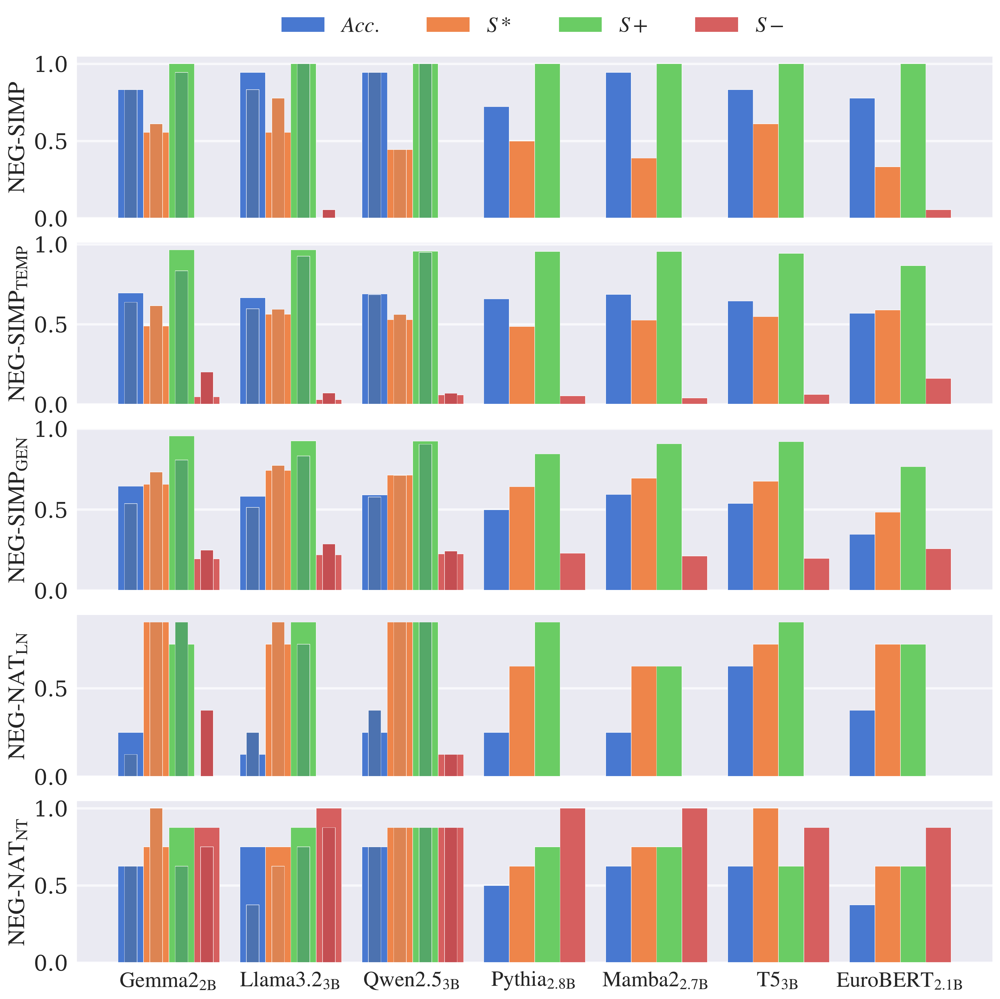
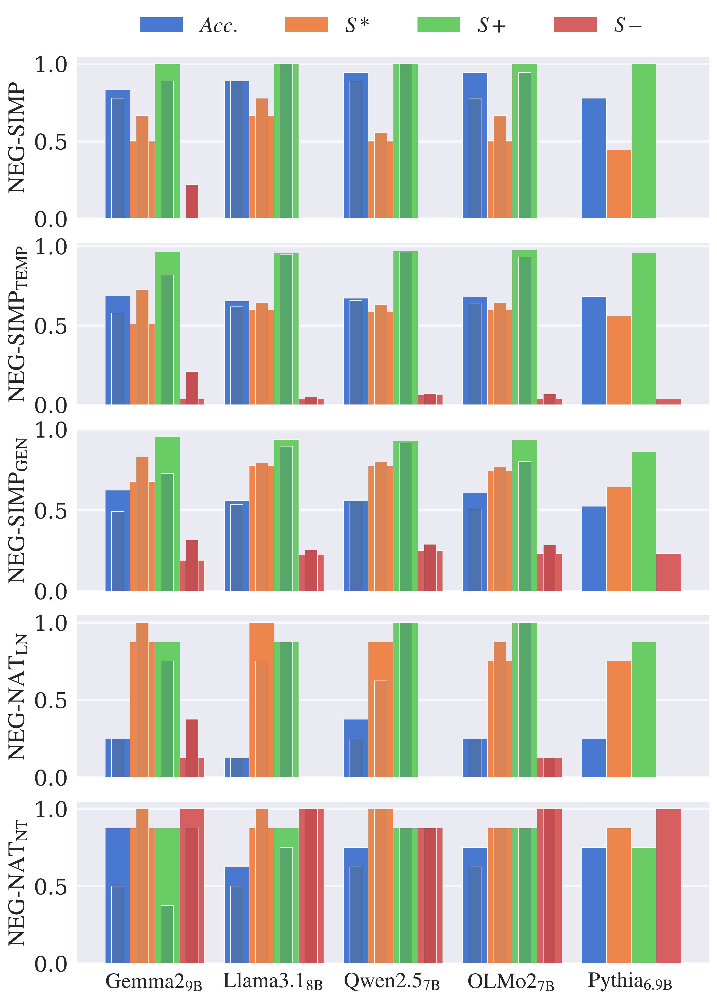

# Psycholinguistic Diagnostics Revisited with Large Language Models

This repository contains the code for the poster presented in 11th International Symposium on Brain and Cognitive Science, titled *Psycholinguistic Diagnostics Revisited with Large Language Models: A case study in negation*. The study takes large inspiration from Ettinger's (2020) experiments with BERT on negation stimuli from psycholinguistics studies. We investigate if anything has changed in terms of task performance with rapid development of large language models past 5-6 years.

Please see the file `poster.pdf` for more details.

### Additional figures not present in the poster

Figure 1: Average metrics over all models on all datasets. Dataset size indicators are omitted from the names. The error bars show the standard deviations.

Figure 2: Performance metric by size figure for all 80
models on NEG-SIMP dataset and its variations. The
model size is shown in logarithmic scale.

Figure 3: Performance metric by size figure for all 80
models on NEG-NAT datasets. The model size is shown
in logarithmic scale.

Figure 4: Performances of different architectures rang-
ing from sizes 2B to 3B parameters. The thinner and
darker bars show the performances of instruction-tuned
versions.

Figure 5: Performances of different architectures rang-
ing from sizes 7B to 9B parameters. The thinner and
darker bars show the performances of instruction-tuned
versions.